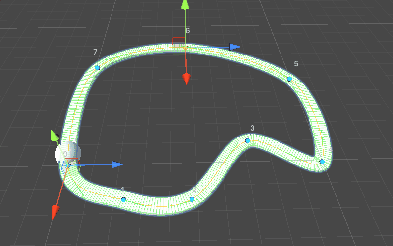
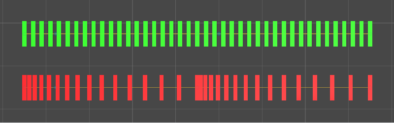
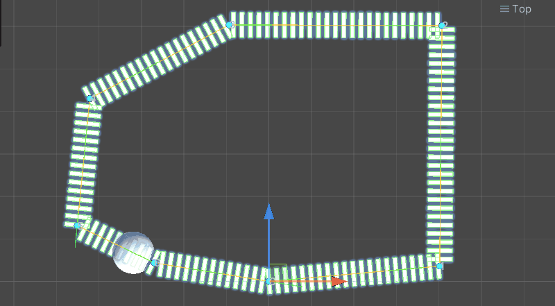

# Unity Spline Framework

A production-ready spline system for Unity featuring arc-length parameterization, rotation-minimizing frames, and a clean runtime/editor separation.



## Features

- **Multiple Curve Types**: Linear, Quadratic Bezier, Cubic Bezier, Catmull-Rom
- **Arc-Length Parameterization**: Even spacing via distance-based evaluation
- **Rotation-Minimizing Frames**: Stable orientation without flipping artifacts
- **Dirty Flag System**: Lazy rebuilding for optimal performance
- **Runtime/Editor Separation**: Assembly definitions enforce compile-time boundaries
- **Production API**: Distance-based evaluation, closest point queries, frame caching

## The Even Spacing Problem

Most spline tutorials use parameter-based evaluation (`Evaluate(t)`), which produces **uneven spacing** on curves. Objects bunch up on tight curves and spread out on straight sections.

This framework solves the problem with **arc-length parameterization**:



| Method | Result |
|--------|--------|
| `Evaluate(t)` | Uneven - objects cluster on curves |
| `EvaluateByDistance(d)` | Even - consistent spacing throughout |

## Stable Orientation with Rotation-Minimizing Frames

The classic Frenet frame (TNB) **flips 180°** at inflection points, causing objects to suddenly invert. This framework implements the **Double Reflection Method** for stable orientation:

| Frame Mode | Behavior |
|------------|----------|
| Frenet | Fast, but flips at inflection points |
| Rotation Minimizing | Stable, no flipping (recommended) |
| Reference Up | Always orients toward a reference direction |

## Curve Types

Supports multiple interpolation methods with the same API:

<!-- TODO: Replace with actual recording cycling through curve types -->


## Editor Integration

Full Unity Editor tooling with scene handles, visualization options, and inspector controls:

## Installation

1. Copy the `Assets/Scripts/Splines` folder into your Unity project
2. Unity will compile the assembly definitions automatically

### Folder Structure

```
Assets/Scripts/Splines/
├── Runtime/
│   ├── Core/           # Interfaces and data structures
│   ├── Segments/       # Curve type implementations
│   ├── Math/           # Pure math utilities
│   └── Spline.cs       # Main component
├── Editor/             # Inspector and handles
└── Samples/            # Example components
```

## Quick Start

### Creating a Spline

1. Create an empty GameObject
2. Add the `Spline` component
3. Click **Initialize** in the inspector
4. Drag control points in the Scene view

### Adding Control Points

| Method | Action |
|--------|--------|
| Inspector | Click "Add Point" button |
| Scene View | `Shift + Left Click` on ground |
| Delete | Select point + `Delete` key |

## Usage

### Basic Evaluation

```csharp
public class Example : MonoBehaviour
{
    [SerializeField] private Spline _spline;

    void Update()
    {
        // T-based (uneven spacing)
        Vector3 position = _spline.Evaluate(0.5f);
        
        // Distance-based (even spacing) - RECOMMENDED
        Vector3 posAtDistance = _spline.EvaluateByDistance(5.0f);
        
        // Normalized distance (0-1 maps to full length)
        Vector3 posAtHalfway = _spline.EvaluateByNormalizedDistance(0.5f);
    }
}
```

### Evaluation with Orientation

```csharp
// Get position + full orientation frame
SplineSample sample = _spline.EvaluateByDistanceWithFrame(5.0f);

transform.position = sample.Position;
transform.rotation = sample.Rotation;

// Individual vectors
Vector3 forward = sample.Tangent;
Vector3 up = sample.Normal;
Vector3 right = sample.Binormal;
```

### SplineFollower Component

Attach to any GameObject for automatic path following.

```csharp
SplineFollower follower = gameObject.AddComponent<SplineFollower>();
follower.Spline = mySpline;
follower.Speed = 2.0f;
follower.LoopMode = LoopMode.PingPong;
follower.Play();
```

**Inspector Settings:**

| Property | Description |
|----------|-------------|
| Speed | Movement speed |
| Follow Mode | `ByDistance`, `ByNormalizedDistance`, `ByTime` |
| Loop Mode | `Once`, `Loop`, `PingPong` |
| Align To Spline | Orient object to curve direction |
| Rotation Offset | Additional rotation adjustment |

### SplineDecorator Component

Spawn objects along a spline (fences, lights, etc).

```csharp
SplineDecorator decorator = gameObject.AddComponent<SplineDecorator>();
decorator.Spline = mySpline;
decorator.Prefab = fencePostPrefab;
decorator.SpacingMode = DecoratorSpacingMode.ByDistance;
decorator.Spacing = 2.0f;
decorator.Rebuild();
```

### Runtime Modification

```csharp
// Read control points
int count = _spline.ControlPointCount;
Vector3 worldPos = _spline.GetControlPointWorldPosition(0);

// Modify control points
_spline.SetControlPointWorldPosition(0, newWorldPosition);
_spline.AddControlPoint(new SplinePoint(localPosition));
_spline.RemoveControlPoint(index);

// Changes trigger automatic rebuild on next evaluation
```

### Finding Closest Point

```csharp
Vector3 queryPoint = player.transform.position;
float closestT;
Vector3 closestPoint = _spline.GetClosestPoint(queryPoint, out closestT);
float distanceAlongSpline = _spline.GetDistanceByT(closestT);
```

### Events

```csharp
void OnEnable()
{
    _spline.OnSplineModified += OnSplineChanged;
}

void OnDisable()
{
    _spline.OnSplineModified -= OnSplineChanged;
}

void OnSplineChanged()
{
    // Spline was rebuilt
}
```

## API Reference

### Spline (MonoBehaviour)

#### Properties

| Property | Type | Description |
|----------|------|-------------|
| `ControlPointCount` | `int` | Number of control points |
| `SegmentCount` | `int` | Number of curve segments |
| `TotalLength` | `float` | Arc-length of entire spline |
| `IsDirty` | `bool` | Whether rebuild is pending |
| `IsLoop` | `bool` | Whether spline forms closed loop |
| `Type` | `SplineType` | Curve type (Linear, CubicBezier, etc) |
| `FrameMode` | `FrameMode` | Orientation computation method |
| `Resolution` | `int` | Arc-length table resolution |

#### Evaluation Methods

| Method | Returns | Description |
|--------|---------|-------------|
| `Evaluate(float t)` | `Vector3` | Position at parameter t [0-1] |
| `EvaluateWithFrame(float t)` | `SplineSample` | Position + orientation at t |
| `EvaluateByDistance(float distance)` | `Vector3` | Position at arc-length distance |
| `EvaluateByDistanceWithFrame(float distance)` | `SplineSample` | Full sample at distance |
| `EvaluateByNormalizedDistance(float normalized)` | `Vector3` | Position at normalized distance [0-1] |
| `EvaluateByNormalizedDistanceWithFrame(float normalized)` | `SplineSample` | Full sample at normalized distance |
| `EvaluateDerivative(float t)` | `Vector3` | Derivative (velocity) at t |
| `GetTangent(float t)` | `Vector3` | Normalized tangent at t |

#### Conversion Methods

| Method | Returns | Description |
|--------|---------|-------------|
| `GetLength()` | `float` | Total arc-length |
| `GetTByDistance(float distance)` | `float` | Convert distance to t parameter |
| `GetDistanceByT(float t)` | `float` | Convert t parameter to distance |
| `GetClosestPoint(Vector3 point, out float t)` | `Vector3` | Find closest point on spline |

#### Control Point Methods

| Method | Description |
|--------|-------------|
| `GetControlPoint(int index)` | Get control point data |
| `SetControlPoint(int index, SplinePoint point)` | Set control point data |
| `GetControlPointWorldPosition(int index)` | Get world position |
| `SetControlPointWorldPosition(int index, Vector3 pos)` | Set world position |
| `SetControlPointPosition(int index, Vector3 localPos)` | Set local position |
| `AddControlPoint(SplinePoint point)` | Add point at end |
| `InsertControlPoint(int index, SplinePoint point)` | Insert point at index |
| `RemoveControlPoint(int index)` | Remove point |

#### Dirty System

| Method | Description |
|--------|-------------|
| `SetDirty()` | Mark for rebuild |
| `RebuildIfDirty()` | Force rebuild if dirty |
| `Initialize()` | Create default control points |

---

### SplineSample (struct)

| Field | Type | Description |
|-------|------|-------------|
| `Position` | `Vector3` | World position |
| `Tangent` | `Vector3` | Forward direction (normalized) |
| `Normal` | `Vector3` | Up direction (normalized) |
| `Binormal` | `Vector3` | Right direction (normalized) |
| `Rotation` | `Quaternion` | Full orientation |
| `T` | `float` | Parameter value [0-1] |
| `Distance` | `float` | Arc-length from start |
| `Frame` | `SplineFrame` | Raw frame data |

---

### SplineFrame (struct)

| Field | Type | Description |
|-------|------|-------------|
| `Tangent` | `Vector3` | Forward vector |
| `Normal` | `Vector3` | Up vector |
| `Binormal` | `Vector3` | Right vector |
| `Rotation` | `Quaternion` | Computed orientation |

---

### SplinePoint (struct)

| Field | Type | Description |
|-------|------|-------------|
| `Position` | `Vector3` | Local position |
| `TangentIn` | `Vector3` | Incoming tangent handle |
| `TangentOut` | `Vector3` | Outgoing tangent handle |
| `AutoTangent` | `bool` | Use automatic tangent calculation |

---

### ISplineSegment (interface)

| Method | Returns | Description |
|--------|---------|-------------|
| `Evaluate(float t)` | `Vector3` | Position at t |
| `EvaluateDerivative(float t)` | `Vector3` | First derivative |
| `EvaluateSecondDerivative(float t)` | `Vector3` | Second derivative |
| `GetControlPoints()` | `Vector3[]` | Control point array |
| `SetControlPoints(Vector3[] points)` | `void` | Set control points |
| `ControlPointCount` | `int` | Number of control points |

---

### BezierMath (static class)

#### De Casteljau Algorithm

```csharp
Vector3 BezierMath.DeCasteljau(Vector3[] points, float t)
Vector3 BezierMath.DeCasteljauDerivative(Vector3[] points, float t)
Vector3 BezierMath.DeCasteljauSecondDerivative(Vector3[] points, float t)
```

#### Polynomial Evaluation

```csharp
// Linear
Vector3 BezierMath.EvaluateLinear(Vector3 p0, Vector3 p1, float t)
Vector3 BezierMath.EvaluateLinearDerivative(Vector3 p0, Vector3 p1)

// Quadratic Bezier
Vector3 BezierMath.EvaluateQuadratic(Vector3 p0, Vector3 p1, Vector3 p2, float t)
Vector3 BezierMath.EvaluateQuadraticDerivative(Vector3 p0, Vector3 p1, Vector3 p2, float t)
Vector3 BezierMath.EvaluateQuadraticSecondDerivative(Vector3 p0, Vector3 p1, Vector3 p2)

// Cubic Bezier
Vector3 BezierMath.EvaluateCubic(Vector3 p0, Vector3 p1, Vector3 p2, Vector3 p3, float t)
Vector3 BezierMath.EvaluateCubicDerivative(Vector3 p0, Vector3 p1, Vector3 p2, Vector3 p3, float t)
Vector3 BezierMath.EvaluateCubicSecondDerivative(Vector3 p0, Vector3 p1, Vector3 p2, Vector3 p3, float t)

// Catmull-Rom
Vector3 BezierMath.EvaluateCatmullRom(Vector3 p0, Vector3 p1, Vector3 p2, Vector3 p3, float t, float tension)
Vector3 BezierMath.EvaluateCatmullRomDerivative(Vector3 p0, Vector3 p1, Vector3 p2, Vector3 p3, float t, float tension)
```

---

### ArcLengthTable (class)

| Property | Type | Description |
|----------|------|-------------|
| `TotalLength` | `float` | Total arc-length |
| `Resolution` | `int` | Number of samples |
| `IsValid` | `bool` | Whether table is built |

| Method | Description |
|--------|-------------|
| `Build(ISplineSegment segment, int resolution)` | Build table for single segment |
| `BuildWithIntegration(ISplineSegment segment, int resolution)` | Build using Simpson's rule |
| `BuildMultiSegment(ISplineSegment[] segments, int resolutionPerSegment)` | Build for multiple segments |
| `GetTByDistance(float distance)` | Convert distance to t (binary search) |
| `GetDistanceByT(float t)` | Convert t to distance |

---

### FrameComputation (static class)

```csharp
// Frenet frame (may flip at inflection points)
SplineFrame FrameComputation.ComputeFrenetFrame(Vector3 tangent, Vector3 secondDerivative)
SplineFrame FrameComputation.ComputeFrenetFrame(ISplineSegment segment, float t)

// Reference-up frame (stable but may twist)
SplineFrame FrameComputation.ComputeFrameWithReferenceUp(Vector3 tangent, Vector3 referenceUp)

// Rotation-minimizing frames (stable, no flipping)
SplineFrame[] FrameComputation.ComputeRotationMinimizingFrames(ISplineSegment segment, int sampleCount, Vector3 initialUp)
SplineFrame FrameComputation.PropagateFrameDoubleReflection(SplineFrame frame, Vector3 t1, Vector3 t2, Vector3 p1, Vector3 p2)

// Interpolation
SplineFrame FrameComputation.InterpolateFrames(SplineFrame a, SplineFrame b, float t)
SplineFrame FrameComputation.GetFrameFromCache(SplineFrame[] cachedFrames, float t)
```

---

### Enums

```csharp
public enum SplineType
{
    Linear,
    QuadraticBezier,
    CubicBezier,
    CatmullRom
}

public enum FrameMode
{
    Frenet,              // Fast but may flip
    RotationMinimizing,  // Stable (recommended)
    ReferenceUp          // Always uses reference direction
}

public enum FollowMode
{
    ByTime,
    ByDistance,
    ByNormalizedDistance
}

public enum LoopMode
{
    Once,
    Loop,
    PingPong
}

public enum DecoratorSpacingMode
{
    ByCount,
    ByDistance,
    ByNormalizedDistance
}
```

## Technical Notes

### Arc-Length Parameterization

Bezier curves have no closed-form arc-length solution. This framework uses:
1. **Simpson's Rule Integration** on derivative magnitude for building the lookup table
2. **Binary Search + Linear Interpolation** for O(log n) distance-to-parameter conversion

### Rotation-Minimizing Frames

The Frenet frame (TNB) flips 180° at inflection points. This framework implements the **Double Reflection Method** (Wang et al.) which propagates frames along the curve with minimal rotation.

### Performance

| Resolution | Memory | Accuracy | Use Case |
|------------|--------|----------|----------|
| 16 | ~128 bytes | ±2% | Mobile, many splines |
| 64 | ~512 bytes | ±0.5% | Standard games |
| 256 | ~2KB | ±0.1% | Cinematics |

The dirty flag system ensures arc-length tables are only rebuilt when control points change.

## Architecture

<!-- TODO: Optional - create diagram using draw.io, Figma, or Mermaid -->
<!--  -->

```
┌─────────────────────────────────────────────────────────────────┐
│                         Spline.cs                                │
│  ┌─────────────┐  ┌─────────────────┐  ┌─────────────────────┐  │
│  │ Control     │  │ ISplineSegment  │  │ ArcLengthTable      │  │
│  │ Points      │─▶│ List            │─▶│ (Binary Search LUT) │  │
│  └─────────────┘  └─────────────────┘  └─────────────────────┘  │
│                            │                      │              │
│                            ▼                      ▼              │
│                   ┌─────────────────┐  ┌─────────────────────┐  │
│                   │ BezierMath      │  │ FrameComputation    │  │
│                   │ (Pure Math)     │  │ (RMF Algorithm)     │  │
│                   └─────────────────┘  └─────────────────────┘  │
└─────────────────────────────────────────────────────────────────┘
                              │
            ┌─────────────────┼─────────────────┐
            ▼                 ▼                 ▼
    ┌──────────────┐  ┌──────────────┐  ┌──────────────┐
    │ SplineSample │  │ SplineFrame  │  │ SplinePoint  │
    │ (Output)     │  │ (TNB Frame)  │  │ (Input)      │
    └──────────────┘  └──────────────┘  └──────────────┘

Assembly Separation:
━━━━━━━━━━━━━━━━━━━━━━━━━━━━━━━━━━━━━━━━━━━━━━━━━━━━━━━━━━━━━━━━━━
  Splines.Runtime.asmdef          │     Splines.Editor.asmdef
  (Ships with game)               │     (Editor only)
  ─────────────────────────────── │ ───────────────────────────────
  • Spline.cs                     │     • SplineEditor.cs
  • All Segments                  │     • SplineHandles.cs
  • BezierMath.cs                 │     • SplineGizmoDrawer.cs
  • ArcLengthTable.cs             │
  • FrameComputation.cs           │
━━━━━━━━━━━━━━━━━━━━━━━━━━━━━━━━━━━━━━━━━━━━━━━━━━━━━━━━━━━━━━━━━━
```
